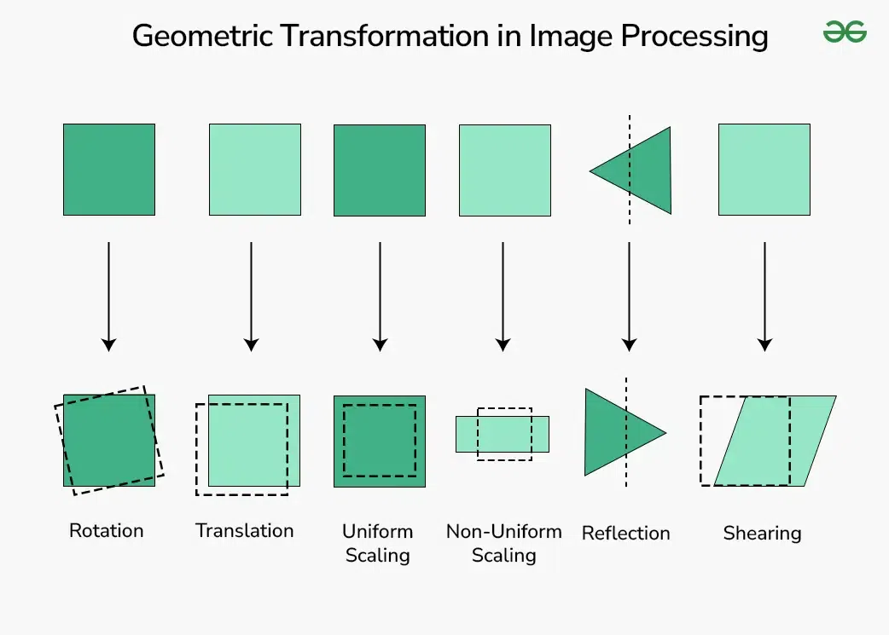
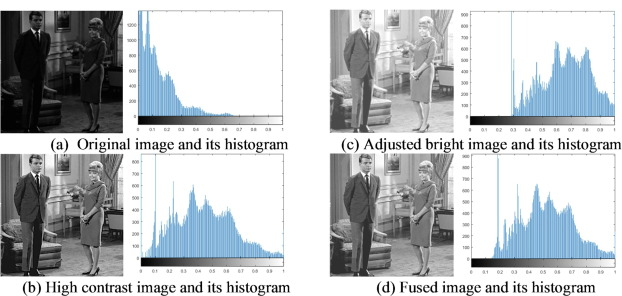
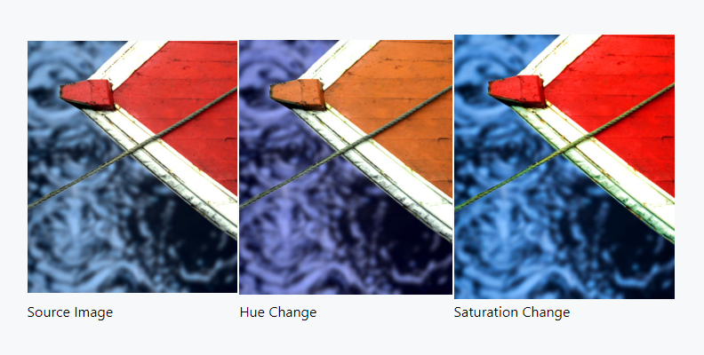

# Data Augmentation Techniques

Data augmentation is a powerful technique used in machine learning and deep learning to artificially increase the size and diversity of training datasets. This is especially useful in scenarios where collecting more data is costly or time-consuming.

## 1. Image Augmentation Techniques
### Geometric Transformations  

- **Rotation**: Rotating images by a certain degree (e.g., 90°, 180°).

- **Flipping**: Horizontally or vertically flipping images. Same as Reflection.

- **Scaling**: Resizing images to a larger or smaller size.

- **Translation**: Shifting images along the x or y axis.

### Color Augmentation

- **Brightness Adjustment**: Modifying the brightness of images.

- **Contrast Adjustment**: Changing the contrast levels.

- **Saturation Adjustment**: Altering the color saturation.

- **Hue Adjustment**: Changing the hue of colors.

### Noise Injection
Adding noise (e.g., Gaussian noise) to images to make models robust to noisy inputs.

### Cutout
Randomly masking out square regions of the image to improve model generalization.

### Random Erasing
Randomly erasing a portion of the image during training.

## 2. Text Augmentation Techniques
- **Synonym Replacement**: Replacing words with their synonyms.
- **Random Insertion**: Inserting random words in the text.
- **Random Deletion**: Randomly removing words from the text.
- **Back Translation**: Translating text to another language and then back to the original language.
- **Sentence Shuffling**: Randomly shuffling sentences in a paragraph.

## 3. Audio Augmentation Techniques
- **Time Stretching**: Altering the speed of the audio without changing its pitch.
- **Pitch Shifting**: Changing the pitch of the audio.
- **Adding Background Noise**: Introducing white noise or other environmental sounds.
- **Volume Adjustment**: Increasing or decreasing the audio volume.
- **Random Cropping**: Taking random segments of the audio clip.

## 4. Tabular Data Augmentation Techniques
- **SMOTE (Synthetic Minority Over-sampling Technique)**: Creating synthetic examples in imbalanced datasets.
- **Random Sampling**: Randomly sampling from existing data points with or without replacement.
- **Adding Noise**: Introducing small random noise to numerical features.
- **Feature Combination**: Creating new features by combining existing ones.

## 5. General Techniques
- **Mixup**: Creating new training samples by combining two or more samples.
- **CutMix**: Combining images by cutting and pasting parts of one image into another.
- **Random Sampling**: Randomly sampling from existing data points to create new instances.

## Conclusion
Data augmentation techniques help improve the robustness and performance of models by introducing variety into the training data. The choice of techniques depends on the specific application and type of data.
