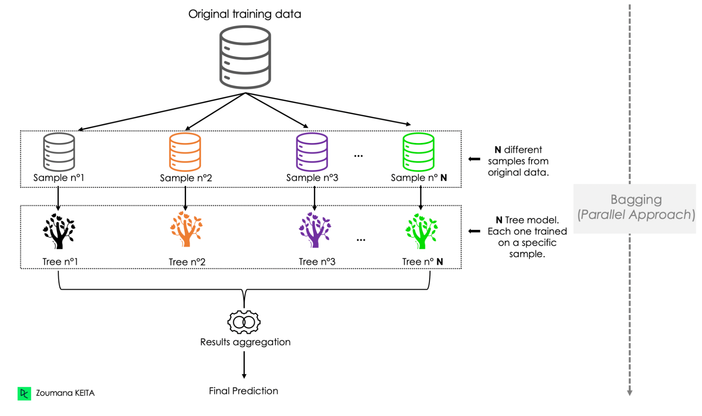
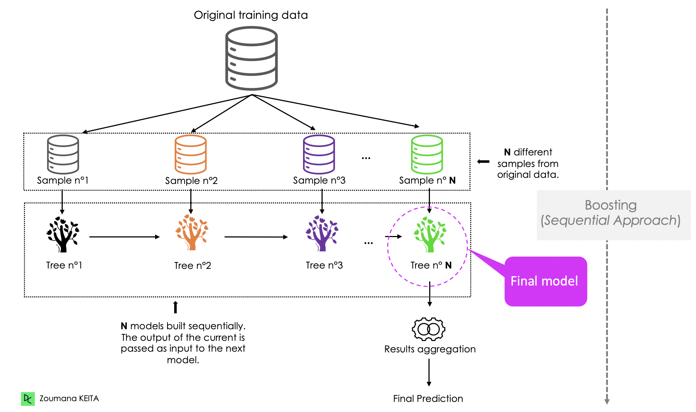
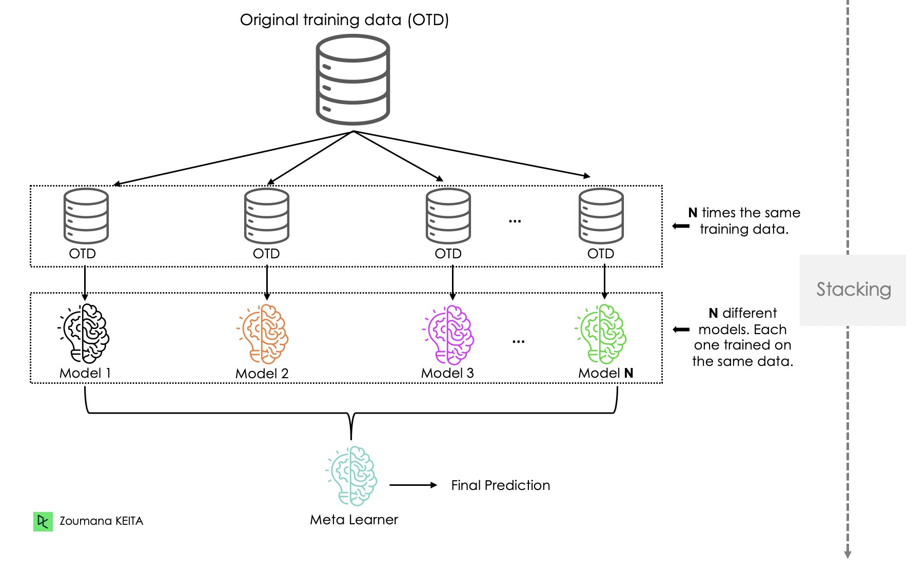
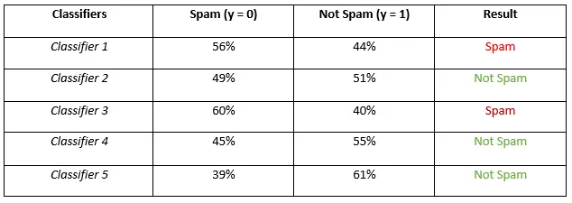
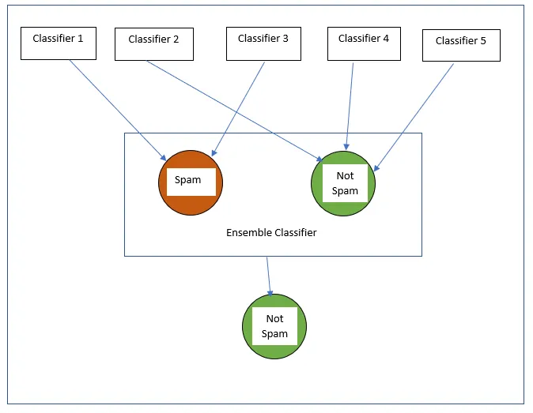
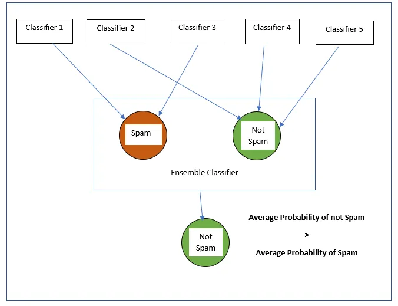

# Ensemble Techniques in Machine Learning

**Ensemble techniques** are methods that combine multiple models (also called "learners") to improve overall performance. Instead of relying on a single model, these techniques aggregate the predictions from several models, which can lead to better generalization and predictive performance.

### Key Advantages of Ensemble Methods:
- **Increased accuracy**: Ensemble models usually outperform individual models.
- **Reduced overfitting**: Aggregating multiple models reduces the risk of overfitting, as mistakes from individual models tend to cancel each other out.
- **Diverse approaches**: Different models in the ensemble can focus on different aspects of the data, making the overall model more robust.

---

## Types of Ensemble Techniques

### 1. **Bagging (Bootstrap Aggregating)**

   - **Main Idea**: Bagging involves creating multiple versions of the training dataset using bootstrapping (sampling with replacement). Each dataset is used to train a separate model, and their predictions are combined by averaging (for regression) or voting (for classification).
   - **Popular Algorithm**: Random Forest (which uses bagging with decision trees).
   - **How It Works**:
     - Multiple models are trained independently on different subsets of the data.
     - The predictions from these models are aggregated (averaged or voted) to make the final prediction.
   - **Advantages**:
     - Reduces variance and helps avoid overfitting.
     - Works well with high variance models (e.g., decision trees).
   - **Disadvantages**:
     - Limited impact on bias, only reduces variance.

### 2. **Boosting**

   - **Main Idea**: Boosting trains models sequentially, where each model tries to correct the errors made by the previous model. It combines weak learners to form a strong model.
   - **Popular Algorithms**: AdaBoost, Gradient Boosting, XGBoost.
   - **How It Works**:
     - The first model is trained on the original data.
     - The second model focuses more on the instances that the first model got wrong.
     - This process is repeated, with each new model trying to correct the errors of the previous models.
     - The final model is a weighted combination of all the models.
   - **Advantages**:
     - Reduces both bias and variance, leading to higher accuracy.
     - Can achieve high accuracy, especially on structured/tabular data.
   - **Disadvantages**:
     - Can be sensitive to noisy data and outliers.
     - Training is sequential, so it's slower than bagging.

### 3. **Stacking**

   - **Main Idea**: Stacking (or stacked generalization) combines multiple models using a "meta-learner." The base models (first layer) make predictions, and then another model (second layer) learns from these predictions.
   - **How It Works**:
     - Train several base models (e.g., decision trees, SVMs, neural networks).
     - Use the predictions of these models as input features for the meta-model.
     - The meta-model (often a linear model) combines the predictions to make the final prediction.
   - **Advantages**:
     - Can combine the strengths of different types of models (e.g., decision trees, linear models, neural networks).
     - Often leads to better performance than individual models.
   - **Disadvantages**:
     - Computationally expensive due to the need to train multiple models.
     - Complex to implement and requires careful tuning of base models and meta-learner.

### 4. **Voting**

   - **Main Idea**: Voting ensembles combine the predictions of multiple models by averaging (for regression) or majority voting (for classification). Unlike stacking, voting uses all models at once without a meta-learner.
   - **Types of Voting**:
     - **Hard Voting**: Uses majority voting (the class with the most votes is selected).
     - **Soft Voting**: Averages the predicted probabilities and selects the class with the highest probability.
   - **How It Works**:
     - Train multiple models independently.
     - Aggregate their predictions using either hard voting or soft voting.
   - **Advantages**:
     - Simple and effective, especially when different models perform well on different parts of the data.
     - Can combine models of different types.
   - **Disadvantages**:
     - Performance heavily depends on the diversity and strength of individual models.
     - Less powerful than stacking or boosting in some cases.

---

## Comparison of Ensemble Techniques:

| **Technique**    | **Approach**                           | **Main Idea**                            | **Strengths**                           | **Weaknesses**                           |
|------------------|----------------------------------------|------------------------------------------|-----------------------------------------|------------------------------------------|
| **Bagging**      | Parallel (independent models)          | Aggregate predictions from multiple models trained on bootstrapped datasets | Reduces variance, prevents overfitting  | Doesn't reduce bias, only variance       |
| **Boosting**     | Sequential (correcting errors)         | Models are trained sequentially to correct previous errors | High accuracy, reduces both bias & variance | Sensitive to noisy data and outliers    |
| **Stacking**     | Parallel (meta-learner)                | Meta-model learns to combine predictions from multiple base models | Can combine models of different types  | Computationally expensive, complex      |
| **Voting**       | Parallel (independent models)          | Aggregate predictions via majority voting or averaging | Simple and effective for diverse models | Limited by the performance of individual models |

---

### Summary:
- **Bagging** focuses on reducing variance by averaging predictions from multiple models trained on bootstrapped datasets.
- **Boosting** reduces both bias and variance by training models sequentially, each correcting the errors of the previous one.
- **Stacking** uses a meta-learner to combine predictions from multiple models, often improving performance.
- **Voting** aggregates predictions using either majority voting or probability averaging, providing a simple ensemble method without a meta-learner.

Each ensemble method has its strengths and weaknesses, and the choice depends on the nature of the problem and the models involved.

### References
- https://www.datacamp.com/tutorial/ensemble-learning-python
- https://medium.com/@awanurrahman.cse/understanding-soft-voting-and-hard-voting-a-comparative-analysis-of-ensemble-learning-methods-db0663d2c008

---
---

# Different Ensemble Technqiues

## 1. AdaBoost (AB)
### Full Name:
**Adaptive Boosting**

### Main Idea:
AdaBoost is an ensemble learning technique that combines multiple weak learners (typically decision trees with a single split, called decision stumps) to create a strong classifier.

### Working Principle:
- AdaBoost works by adjusting the weights of incorrectly classified instances. Initially, all instances have equal weights.
- In each iteration, a weak learner is trained, and the instances that were misclassified get their weights increased. This ensures that the next weak learner focuses more on those hard-to-classify instances.
- The final model is a weighted combination of all the weak learners.

### Advantages:
- Simple to implement and works well on a variety of tasks.
- Reduces overfitting compared to many other classifiers.

### Disadvantages:
- Sensitive to noisy data and outliers because AdaBoost can overly focus on hard-to-classify points.

### Use Cases:
- Works well for binary classification problems, although it can be extended to multi-class classification.

### References:
- https://www.youtube.com/watch?v=LsK-xG1cLYA 
- https://machinelearningmastery.com/boosting-and-adaboost-for-machine-learning/?ref=blog.paperspace.com#:~:targetText=Boosting
- https://blog.paperspace.com/adaboost-optimizer/#:~:text=AdaBoost%20is%20an%20ensemble%20learning,turn%20them%20into%20strong%20ones.
- https://scikit-learn.org/dev/modules/generated/sklearn.ensemble.AdaBoostClassifier.html

---

## 2. XGBoost (XB)
### Full Name:
**Extreme Gradient Boosting**

### Main Idea:
XGBoost is a more advanced form of boosting that uses gradient boosting techniques. It is highly efficient, scalable, and regularly used in machine learning competitions due to its superior performance.

### Working Principle:
- Like AdaBoost, XGBoost builds an ensemble of decision trees. However, XGBoost is based on **gradient boosting**, where each new tree is trained to correct the residual errors (differences between predictions and actual values) made by the previous trees.
- XGBoost optimizes using second-order gradients (Hessian matrix), which provides more information about the loss function compared to traditional boosting.
- It includes regularization techniques (L1 and L2) to prevent overfitting.

### Advantages:
- Highly efficient and scalable for large datasets.
- Provides mechanisms for handling missing data.
- Has built-in regularization to reduce overfitting.

### Disadvantages:
- Tuning hyperparameters can be complex, and improper tuning may lead to suboptimal performance.
- Can be computationally expensive for very large datasets if not optimized.

### Use Cases:
- Widely used for structured/tabular data, especially in competitions like Kaggle. Commonly applied in classification and regression tasks.

---

## 3. Comparison: AdaBoost vs XGBoost

| Feature                   | **AdaBoost**                                      | **XGBoost**                                      |
|---------------------------|---------------------------------------------------|---------------------------------------------------|
| **Type of Boosting**       | Adaptive Boosting                                 | Gradient Boosting                                |
| **Error Correction**       | Reweights instances based on previous errors      | Fits to residual errors using gradient descent    |
| **Learners Used**          | Typically uses weak learners (e.g., decision stumps) | Generally uses decision trees (more complex trees)|
| **Regularization**         | Limited regularization                            | Strong regularization (L1 and L2)                 |
| **Speed**                  | Generally slower than XGBoost for larger datasets | Extremely fast due to optimization techniques     |
| **Handling of Missing Data** | No special handling of missing data               | Can automatically handle missing data             |
| **Common Applications**    | Binary and multi-class classification             | Classification, regression, ranking problems      |

### Summary:
Both AdaBoost and XGBoost are powerful ensemble learning techniques with different use cases. AdaBoost works well for simpler tasks, while XGBoost is a highly optimized and powerful tool for large, complex datasets.
