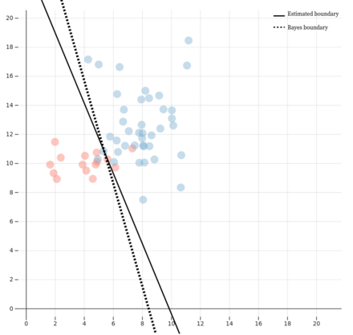
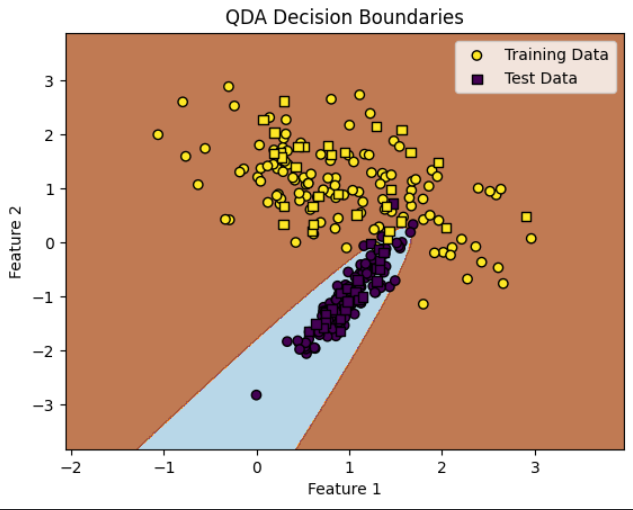

### Linear Discriminant Analysis (LDA):

- **Type:** Probabilistic, linear classifier.
- **Approach:** LDA assumes that the data from each class is normally distributed, and it works by modeling the distribution of the data in each class and finding a linear combination of features that separates the classes well. It tries to maximize the distance between means of classes while minimizing the variation within each class.
- **Assumptions:**
    - Assumes that the data for each class comes from a Gaussian (normal) distribution.
    - Assumes that all classes share the same covariance matrix.
- **Output:** Gives probabilistic class membership predictions.
- **Efficiency:** Works well for problems where class distributions are approximately Gaussian and can handle small datasets well.
- **Use Cases:** Suitable when the data is linearly separable and normally distributed with shared covariances. It is efficient when there's a small sample size compared to the number of features.
- **Ref:**
    - https://en.wikipedia.org/wiki/Linear_discriminant_analysis

---
### Quadratic Discriminant Analysis (QDA):

- **Type:** Probabilistic, non-linear classifier.
- **Approach:** QDA models the data distribution of each class separately and finds a quadratic decision boundary. Unlike LDA, QDA allows for different covariance matrices for each class, which makes it more flexible when dealing with data that is not linearly separable.
- **Assumptions:**
  - Assumes that the data for each class comes from a Gaussian (normal) distribution.
  - Allows different covariance matrices for each class, thus capturing more complex relationships in the data.
- **Output:** Provides probabilistic class membership predictions.
- **Efficiency:** More computationally expensive than LDA due to the separate covariance matrices for each class, but better suited for cases where the decision boundary between classes is non-linear.
- **Use Cases:** Suitable when data is not linearly separable and has varying covariance structures between different classes. Often used in cases where a quadratic decision boundary is required.
- **Ref:**  
    - https://www.kaggle.com/discussions/general/448328

---
### Naive Bayes:
- **Type:** Probabilistic classifier.
- **Approach:** Naive Bayes is based on Bayes' Theorem and assumes that the features are conditionally independent of each other given the class (this is the "naive" assumption). It calculates the probability of each class based on the input features and selects the class with the highest posterior probability.
  
- **Assumptions:**
  - Assumes that all features are independent of each other (which is rarely true in real-world data).
  - Assumes that the features contribute equally and independently to the outcome.
  
- **Variants:**
  - **Gaussian Naive Bayes**: Assumes that the continuous features follow a Gaussian distribution.
  - **Multinomial Naive Bayes**: Suitable for discrete feature counts, commonly used in text classification.
  - **Bernoulli Naive Bayes**: Works for binary/boolean features, also used in text classification (presence or absence of words).

- **Output:** Returns the probability of each class given the input features and predicts the class with the highest probability.

- **Efficiency:** Fast and computationally efficient, making it suitable for real-time applications. It works well with large datasets and is particularly effective in text classification and spam filtering.

- **Use Cases:** 
  - Document classification (spam detection, sentiment analysis)
  - Medical diagnosis
  - Recommender systems
  - Multi-class classification problems where feature independence can be assumed.

- **Advantages:**
  - Works well even with small datasets.
  - Simple to implement and highly scalable for large datasets.
  
- **Limitations:**
  - The assumption of independence between features is rarely true, which can lead to suboptimal performance if the assumption is strongly violated.
  - Not ideal for highly correlated data.

- **Ref:** 
    - https://www.geeksforgeeks.org/naive-bayes-classifiers/
    - https://scikit-learn.org/1.5/modules/naive_bayes.html

---
### Gaussian Process Classification (GPC):
- **Type:** Probabilistic, non-parametric classifier.
- **Approach:** Gaussian Process Classification uses Gaussian processes to model the distribution of functions that map input features to output classes. It provides a flexible approach to classification by treating the output as a sample from a Gaussian process, allowing for uncertainty estimation in predictions. It uses the properties of Gaussian distributions to make predictions about the likelihood of each class given the input data.

- **Assumptions:**
  - Assumes that the data can be modeled as a Gaussian process.
  - The observations are noisy, and the model accounts for uncertainty in predictions.

- **Output:** Provides class probabilities for each input instance, allowing for uncertainty quantification in predictions. The model predicts the mean and variance of the output, helping to understand the confidence of the classification.

- **Efficiency:** More computationally intensive than many traditional classifiers, particularly for large datasets, as it involves matrix inversions and can scale cubically with the number of training samples. However, it is highly expressive and flexible.

- **Use Cases:** 
  - Suitable for applications requiring uncertainty estimates alongside predictions, such as:
    - Medical diagnosis
    - Robotics and control
    - Environmental modeling
    - Any domain where understanding the confidence of predictions is critical.

- **Advantages:**
  - Can model complex decision boundaries.
  - Provides a measure of uncertainty in predictions, useful for risk-sensitive applications.
  
- **Limitations:**
  - Computationally expensive, especially for large datasets.
  - Requires careful selection of the kernel function, which can significantly impact performance.

- **Ref:**
    - https://scikit-learn.org/1.5/modules/gaussian_process.html
    - https://www.youtube.com/watch?v=5Cqi-RAwAu8

---
### Support Vector Machine (SVM):
- **Type:** Supervised learning classifier.
- **Approach:** SVM aims to find the optimal hyperplane that separates classes in a high-dimensional space. It maximizes the margin between the nearest points of the classes (support vectors) while allowing for some misclassification through a soft margin.
  
- **Assumptions:**
  - Assumes that data can be linearly separable or can be transformed into a higher-dimensional space to achieve separation.

- **Output:** Predicts class labels based on the position of the input data relative to the hyperplane.

- **Efficiency:** Effective in high-dimensional spaces and works well with a clear margin of separation. However, it can be less efficient with large datasets.

- **Use Cases:** Suitable for classification tasks, including image recognition, text categorization, and bioinformatics.

- **Ref:**
    - https://www.geeksforgeeks.org/support-vector-machine-algorithm/

---

### Artificial Neural Network (ANN):
- **Type:** Supervised learning model inspired by biological neural networks.
- **Approach:** ANNs consist of interconnected layers of neurons, including an input layer, one or more hidden layers, and an output layer. They learn to map inputs to outputs by adjusting weights based on error feedback through backpropagation.
  
- **Assumptions:**
  - Assumes that the relationship between inputs and outputs can be approximated by a complex, nonlinear function.

- **Output:** Produces predictions for classification or regression tasks.

- **Efficiency:** Computationally intensive, especially for deep networks, but capable of learning complex patterns from large datasets.

- **Use Cases:** Widely used in image recognition, natural language processing, and any domain requiring nonlinear function approximation.

- **Ref:**
    - https://www.geeksforgeeks.org/artificial-neural-networks-and-its-applications/

---

### AdaBoost (Adaptive Boosting):
- **Type:** Ensemble learning method.
- **Approach:** AdaBoost combines multiple weak classifiers to create a strong classifier. It assigns weights to each training instance and focuses on the misclassified instances, adjusting weights iteratively to improve overall classification accuracy.
  
- **Assumptions:**
  - Assumes that weak classifiers can be combined to form a strong classifier.

- **Output:** Provides a final classification based on the weighted majority vote of the weak classifiers.

- **Efficiency:** Generally fast and effective, but can be sensitive to noisy data and outliers.

- **Use Cases:** Commonly used in image classification, face detection, and any application where boosting can improve weak learner performance.

- **Ref:** 
    - https://www.almabetter.com/bytes/tutorials/data-science/adaboost-algorithm
    - https://scikit-learn.org/dev/modules/generated/sklearn.ensemble.AdaBoostClassifier.html
---

### Logistic Regression:
- **Type:** Statistical method for binary classification.
- **Approach:** Logistic regression models the probability of a binary outcome based on one or more predictor variables using the logistic function. It predicts the likelihood that an instance belongs to a particular class by estimating coefficients for the input features.
  
- **Assumptions:**
  - Assumes a linear relationship between the log-odds of the outcome and the predictor variables.

- **Output:** Provides probabilities that can be thresholded to classify instances into binary classes.

- **Efficiency:** Computationally efficient and interpretable, making it suitable for smaller datasets or when interpretability is important.

- **Use Cases:** Used in medical diagnosis, marketing response prediction, and any scenario where binary outcomes are analyzed.

- **Ref:** 
    - https://www.geeksforgeeks.org/understanding-logistic-regression/

---

### Decision Tree:
- **Type:** Supervised learning model.
- **Approach:** Decision trees split the data into subsets based on feature values, forming a tree structure where each internal node represents a decision based on a feature, and each leaf node represents a class label. It recursively partitions the data to minimize impurity (e.g., Gini impurity or entropy).
  
- **Assumptions:**
  - Assumes that the data can be split effectively using decision rules based on feature values.

- **Output:** Predicts class labels based on the path traversed in the tree from the root to the leaf node.

- **Efficiency:** Fast and easy to interpret, but can be prone to overfitting if not properly regularized.

- **Use Cases:** Suitable for both classification and regression tasks, including customer segmentation, loan approval, and more.

- **Ref:** 
    - https://www.geeksforgeeks.org/decision-tree/

---

### Random Forest:
- **Type:** Ensemble learning method based on decision trees.
- **Approach:** Random Forest constructs multiple decision trees during training and outputs the mode of the classes (for classification) or mean prediction (for regression) of the individual trees. It introduces randomness by sampling data points and features to create diverse trees.
  
- **Assumptions:**
  - Assumes that combining multiple trees can lead to better predictive performance than any single tree.

- **Output:** Provides class predictions based on the aggregate results of the individual trees.

- **Efficiency:** Generally more robust and accurate than single decision trees, reduces overfitting, and handles large datasets well.

- **Use Cases:** Widely used in classification and regression tasks across various domains, including finance, healthcare, and marketing.

- **Ref:** 
    - https://www.geeksforgeeks.org/random-forest-algorithm-in-machine-learning/
